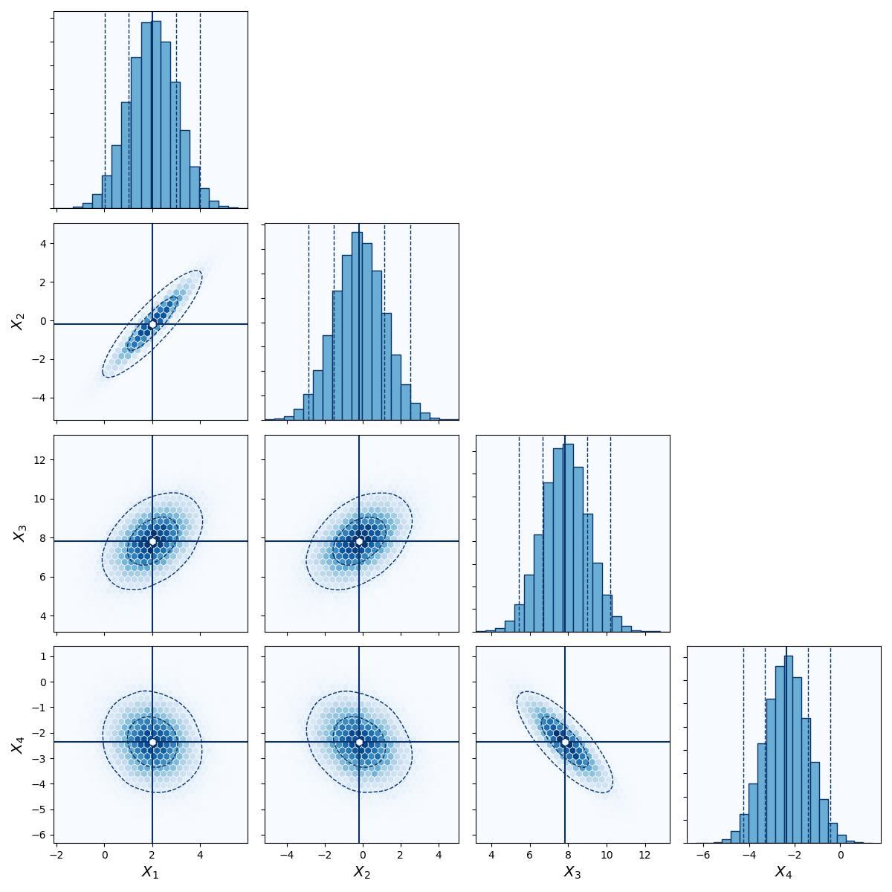

``cornerhex`` Documentation
===========================

| ``cornerhex`` is a package to visualize multidimensional data in matrix corner plots, for example the results of Markov Chain Monte Carlo (MCMC) methods.
| Instead of 2d histograms or scatter plots it uses ``matplotlib.pyplot.hexbin``. ``cornerhex`` can be easily costumized with different color schemes.

Installation
------------

| To install ``cornerhex`` simply type
| ``pip install cornerhex``

| Please have a look at the following examples to learn how to use ``cornerhex``.

.. toctree::
   :maxdepth: 2
   :caption: Contents:

   1_quickstart
   2_customizations
   A_contrib_bug_feature
   api

| ``cornerhex`` is free to use. Please acknowledge the ``cornerhex`` repository if using it for publications.

Indices and tables
==================

* :ref:`genindex`
* :ref:`modindex`
* :ref:`search`
